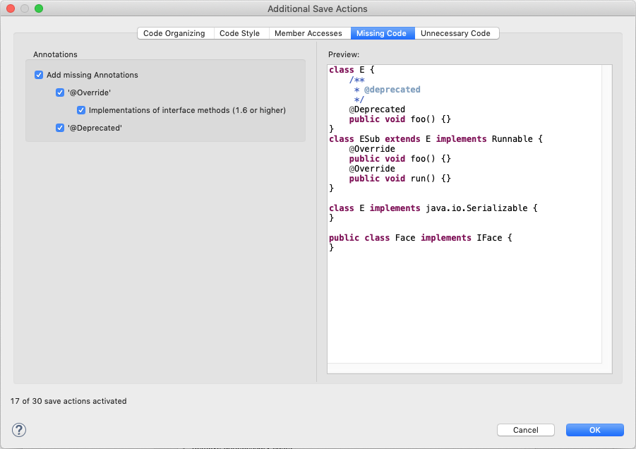

# IDE Settings

Please import the following settings (Eclipse format) in your IDE:

* [Formatter](retest-formatter.xml)
* [Clean up](retest-clean-up.xml)
* [Import order](retest-imports.importorder)

Unfortunately, it is currently not possible to export save actions. Therefore, please set them up as follows:

If you are using IntelliJ, check out the [Eclipse code formatter plugin](https://plugins.jetbrains.com/plugin/6546-eclipse-code-formatter).
