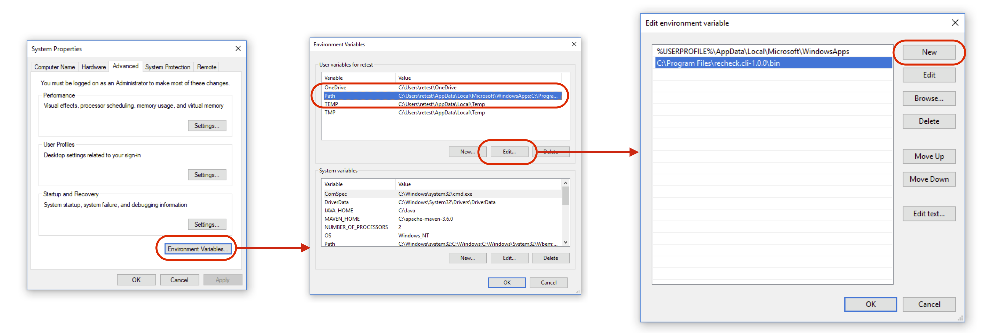

Setting up the CLI
==================

You can download the most recent version from the [GitHub releases page](https://github.com/retest/recheck.cli/releases/). Afterwards, you have to include the CLI into your path to use it from your shell, which heavily depends on your operating system and version thereof.

In any case, you can verify whether this worked correctly by typing `recheck` into a newly started shell. The output should show a help message like this:

```text
$ recheck
Usage: recheck [--help] [--version] [COMMAND]
Command-line interface for recheck.
      --help      Display this help message.
      --version   Display version info.
Commands:
  version     Display version info.
  diff        Display given differences.
  commit      Accept given differences.
  ignore      Ignore given differences.
  completion  Generate and display auto completion script.
  help        Displays help information about the specified command.
```

## Linux and Mac

Unzip the downloaded archive to e.g. `/opt/recheck.cli-1.0.0`. Then add the following snippet to your `.bash_profile` and/or `.bashrc`:

```text
export PATH="${PATH}:/path/to/recheck.cli/bin/"
```

### Enabling Shell Auto-Completion

You can obtain an auto-completion script for Bash and ZSH via the `completion` command. Simply add the resulting output to your `.bash_profile` and/or `.bashrc`, for example:

```text
$ echo "source <(recheck completion)" >> ~/.bash_profile
```

Please note that this requires Bash version 4+ (macOS currently comes with version 3).

## Windows

Unzip the downloaded archive to e.g. `C:\Program Files\recheck.cli-1.0.0`. To include the CLI into your path, you can follow [this tutorial](https://java.com/en/download/help/path.xml). On Windows 10, for instance, it works like this:

1. Open settings.
2. Enter "env" and select "Edit the system environment variables."
3. Click on the tab "Advanced" -> "Environment Variables" -> "Path" -> "Edit" -> "New".
4. Add the path to the `recheck/bin` folder. If you installed it like above, that would be `C:\Program Files\recheck.cli-1.0.0\bin\`.


