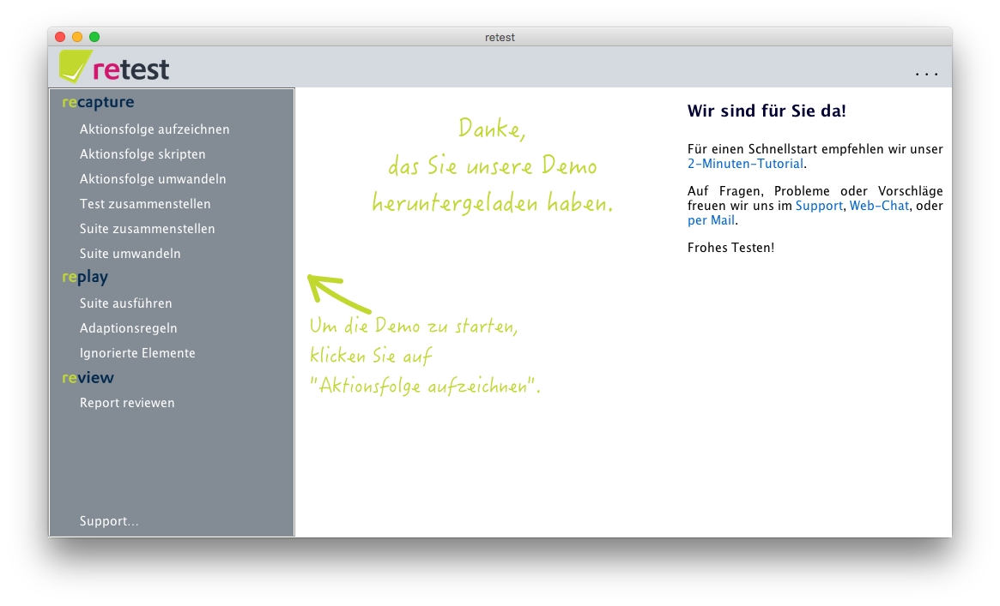
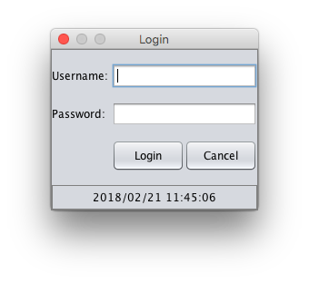
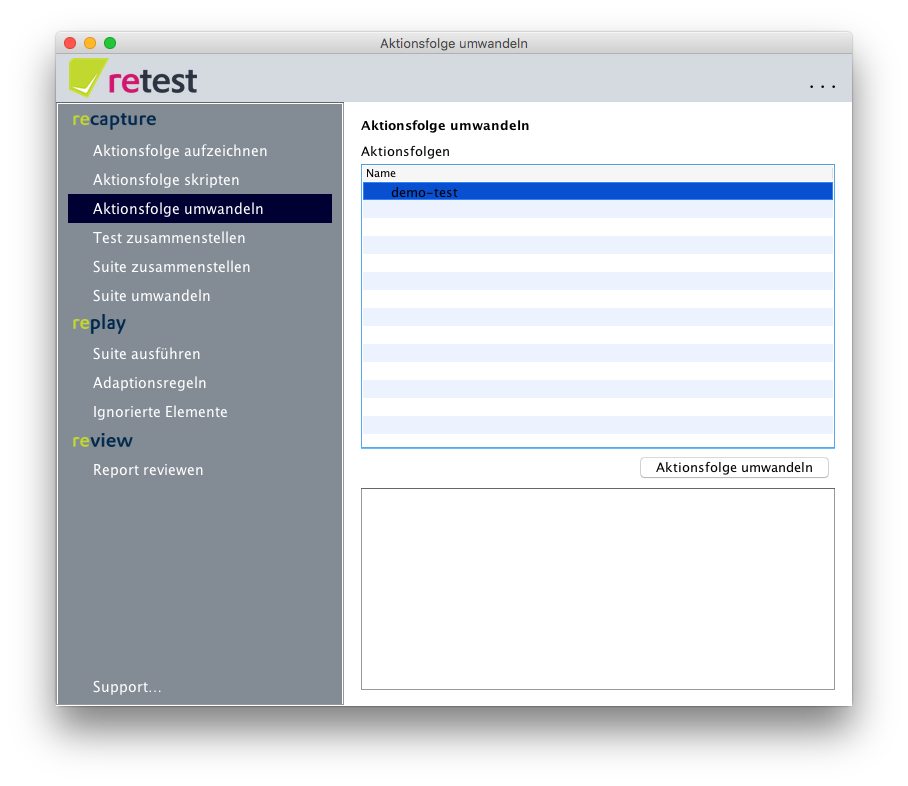
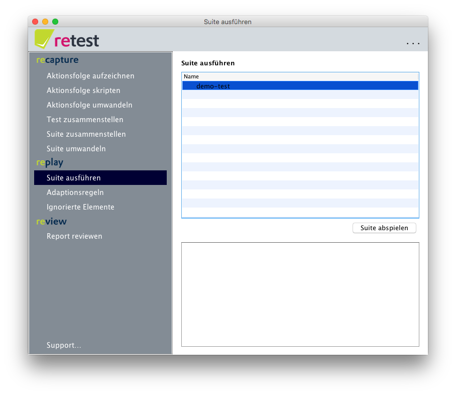
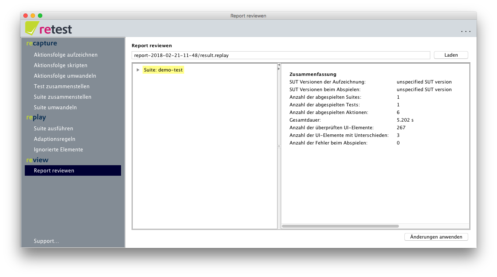
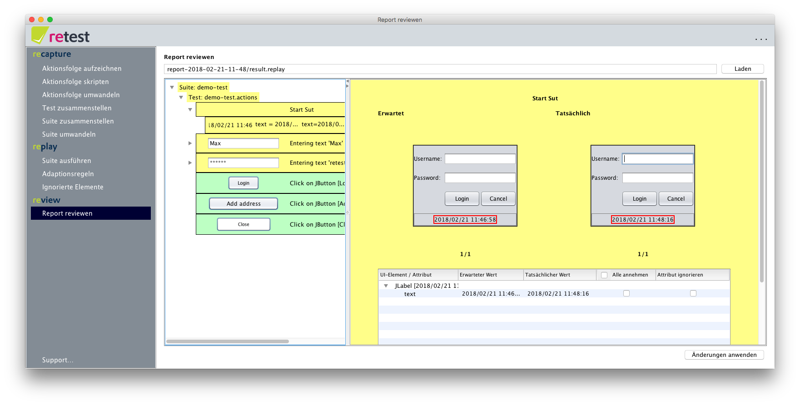
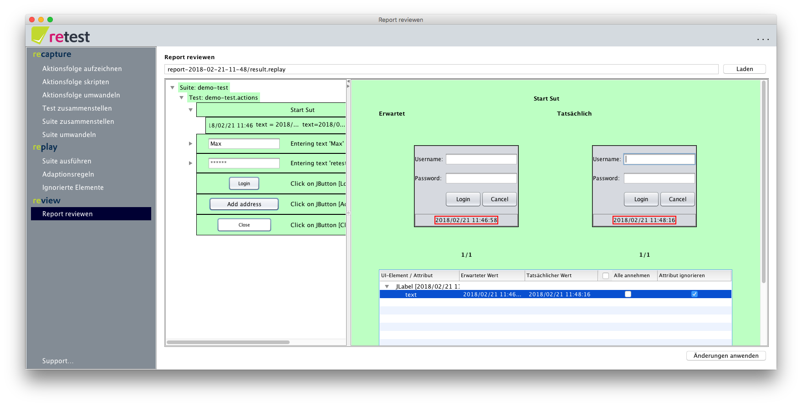
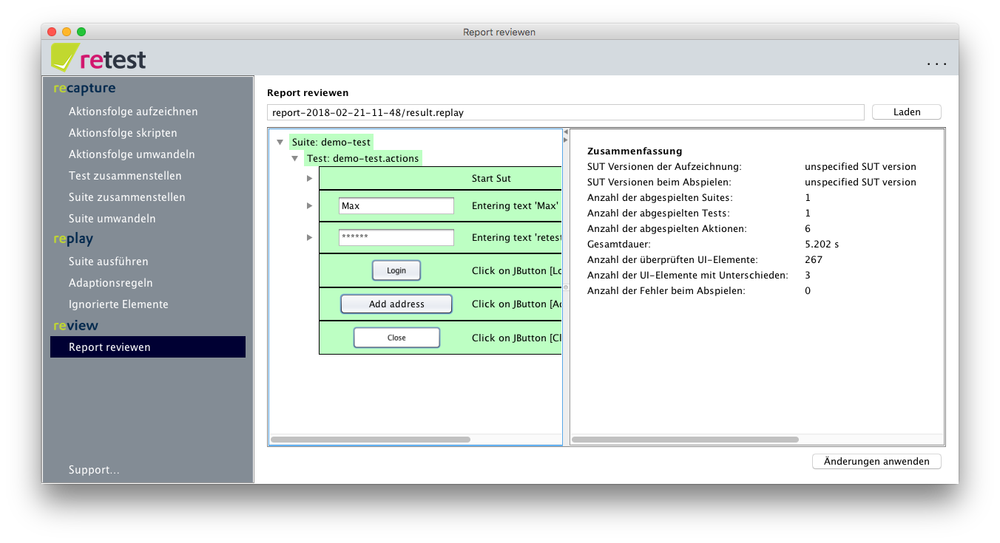
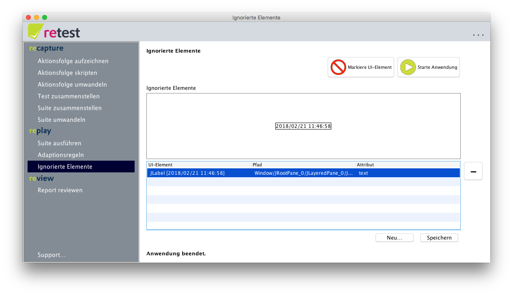

Das 2-Minuten Difference-Testing-Tutorial mit der retest Demo
=============================================================

Wenn Sie die retest-Demo herunter geladen haben, dann haben Sie eine zip-Datei vorliegen.
Nach dem entzippen finden Sie drei Ordner:

1. `retest` enthält alle Daten von retest und sollte unverändert bleiben.
2. `retest-workspace` enthält alle Arbeits-Daten von retest: Konfigurationen, Aktionsfolgen, Tests, Suites, Berichte, Log-Dateien, ...
3. `system-under-test` enthält die zu testende Anwendung, in diesem Fall eine kleine Demo.

Öffnen Sie den Ordner `retest` und klicken Sie, je nach Betriebssystem, auf `retest-gui.exe` (Windows)
oder die ausführbare `retest`-Datei (Linux/Mac). Dann sollte sich der retest Startbildschirm öffnen. 
Sollten Sie bis hierher Probleme haben, so melden Sie sich bitte unter http://feedback.retest.de/
oder per E-Mail unter [support@retest.de](mailto:support@retest.de). 

Wie Sie sehen befindet sich im linken Teil das Menü. Es kann über einen Klick auf das retest-Logo ein- und ausgeblendet werden.
Um unteren Rand des Menüs finden Sie einen Link zu unserem [Support](http://feedback.retest.de). 
Im rechten Bereich sehen Sie eine kleine Erläuterung, die je nach geöffnetem Menüpunkt wechselt und Hilfen und Tipps gibt.
Diese Erläuterungen können unter dem `...`-Knopf im rechten oberen Rand mit einem Klick auf "Beschreibung anzeigen" ein- und ausgeblendet werden.

Test aufzeichen und umwandeln
-----------------------------

Um einen einfachen Test aufzuzeichnen klicken Sie im Menü einfach auf "Aktionsfolge aufzeichnen".

In der sich öffnenden Ansicht können Sie z.B. auf "Starte Aufzeichnung" klicken.
Dann öffnet das Login-Fenster unserer Demo-Anwendung, der [SUT](../testprozess/was-ist-die-sut.md).

Hier können Sie sich z.B. mit dem Benutzernamen "Max" und dem Passwort "retest" anmelden und dann z.B. einen Wert in der Tabelle editieren.
Klicken Sie nun auf "Stoppe Anwendung" und dann auf "Speichern..." um Ihren neuen Test unter einem beliebigen Namen abzuspeichern.

Danach klicken Sie im Menü auf "Aktionsfolge umwandeln".

Diese Ansicht erlaubt es Ihnen Ihre gerade aufgezeichnete [Aktionsfolge](../testprozess/definitionen.md) erneut auszuführen, 
und sie dabei mit Zustandsinformationen anzureichern und sie so zu einer ausführbare Suite (Englisch "[executable suite](../testprozess/definitionen.md)") umzuwandeln. 
Um dies zu tun wählen Sie Ihre erstellte Aktionsfolge aus und drücken Sie auf "Aktionsfolge umwandeln".
Sie können nun zuschauen, wie retest die Aktionsfolge erneut abspielt.

Test abspielen und reviewen
---------------------------

Nun können Sie Ihre Suite ausführen, indem Sie den Menüpunkt "Suite ausführen" auswählen.

Wählen hier Ihre gerade neu erzeugte Suite aus und drücken Sie auf "Suite abspielen".
Erneut wird die Suite abgespielt – jedoch wird im Anschluss daran direkt und automatisch der Menüpunkt "Report reviewen" geöffnet
und die Ausführungsergebnisse Ihrer Suite geladen.

Im linken Teil der Ansicht sehen Sie eine Baumstrucktur, welche Sie durch anklicken aufklappen können. 
Auf der obersten Ebene dieser Struktur sehen Sie Suites, darunter Tests, darunter die einzelnen Aktionen, 
und darunter die Struktur der geänderten UI-Elemente.
Wie Sie sehen nutzen wir auch eine Farbkodierung: 
grün bedeutet es gab keine Änderung nach der Ausführung eines Testschrittes,
gelb bedeutet es gab Änderungen.

Wie Sie sehen gab es bereits Änderungen – so sind die ersten drei Testschritte gelb markiert.
Öffnen Sie die Baumstruktur und navigieren Sie z.B. zu der ersten Aktion "Start SUT".

Wie Sie nun sehen stammt die Änderung aus der Anzeige der Uhrzeit auf dem Login-Dialog der SUT.
Da sich die Uhrzeit kontinuierlich ändert macht es keinen Sinn diese Änderung zu übernehmen.
Klicken Sie stattdessen auf die Checkbox in der Tabellenspalte "ignorieren" um das `Text`-Attribut dieses Elements dauerhaft zu ignorieren,
oder Ignorieren Sie das komplette UI-Element und alle Kind-Elemente dauerhaft mit einem Klick auf die Checkbox "Dieses UI-Element dauerhaft ignorieren".

In beiden Fällen sehen Sie, wie sich der komplette Report nun grün färbt, da retest automatisch gleiche Änderungen auf alle betroffenen UI-Elemente anwendet.
Um diese Änderungen nun dauerhaft zu übernehmen klicken Sie auf "Änderungen anwenden".

Ein kleiner Dialog erscheint, der alle geänderten Dateien im einzelnen anzeigt, und Sie daran erinnert diese zu "committen", 
sollten Sie ein Versionsverwaltungssystem für Ihre Tests verwenden.

Klicken Sie nun erneut auf den Menüeintrag "Suite ausführen" und führen Sie Ihre Suite erneut aus.

Wie Sie nun sehen, ist die Suite komplett grün – was bedeutet, dass es keine Änderungen gab.
Wenn Sie sehen wollen welche Elemente und Attribute derzeit von retest ignoriert werden, 
so klicken Sie einfach auf den Menüpunkt "Ignorierte Elemente".

Als nächstes können Sie komplexere [Tests](../recapture/test-zusammenstellen.md) und [Suites](../recapture/suite-zusammenstellen.md) aufzeichnen,
Ihre Aufzeichnung [interaktiv debuggen](../recapture/aktionsfolge-bearbeiten.md),
oder unsere [2 Minuten Surili-Tour mit der retest Demo](2-min-surili-demo-tutorial.md) machen.

