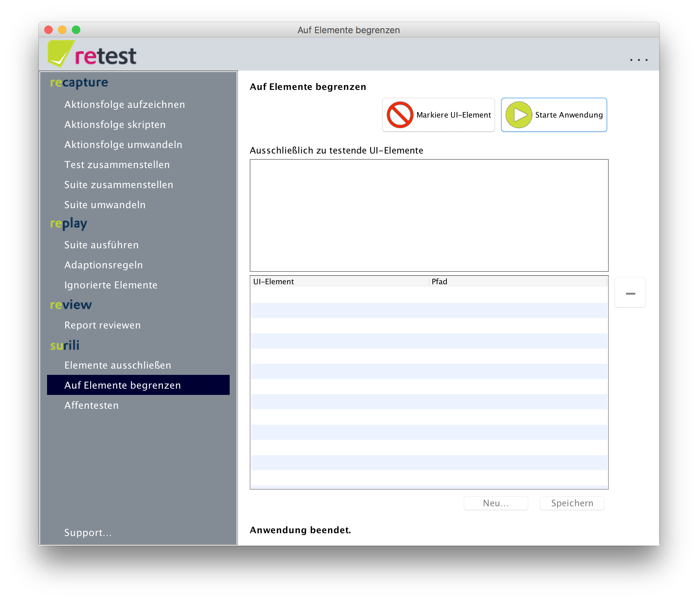
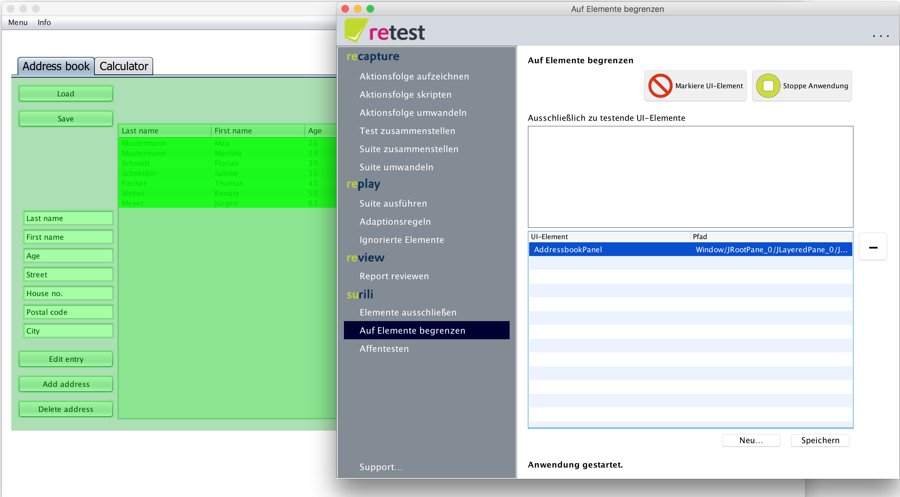
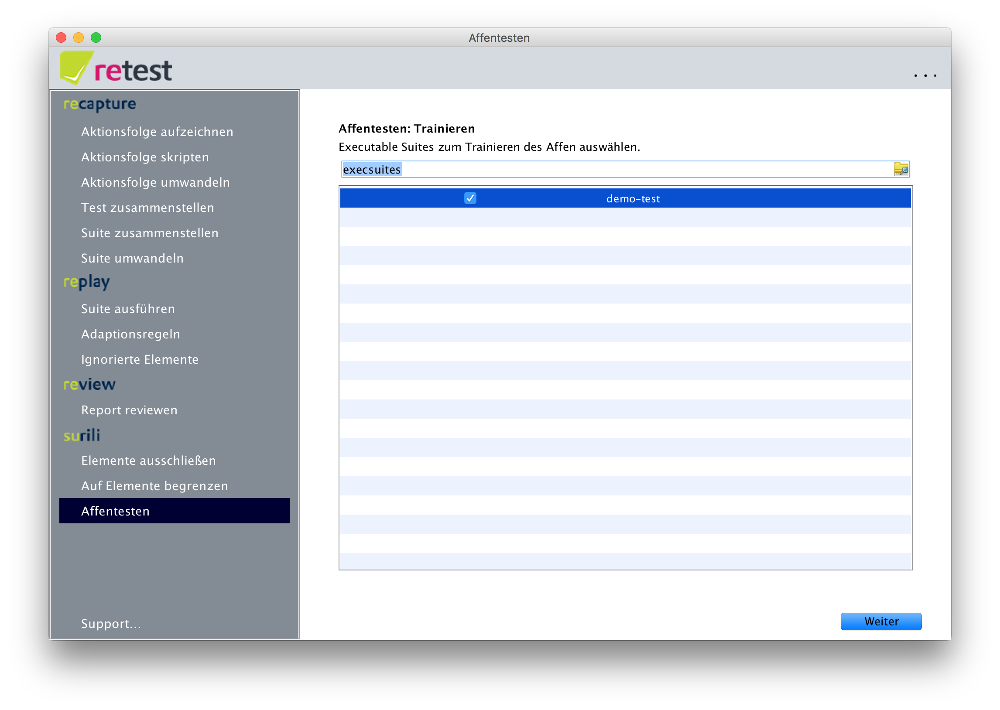
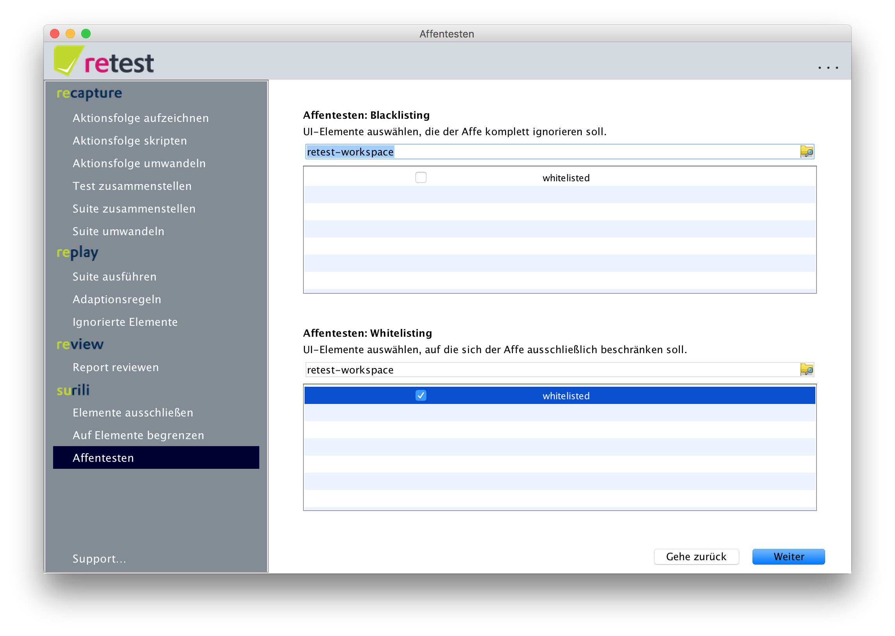
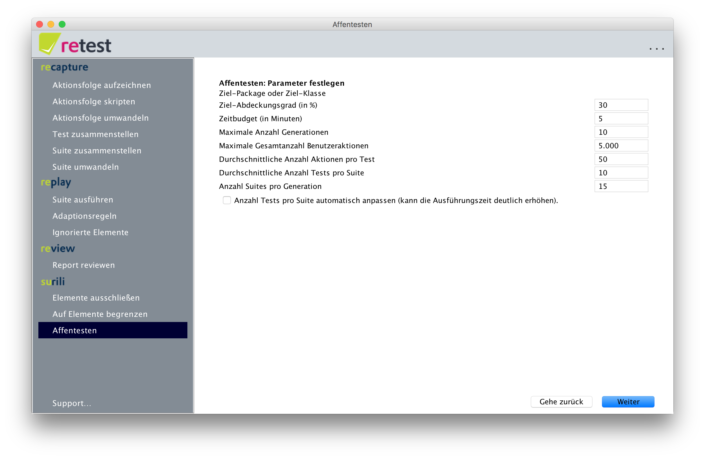
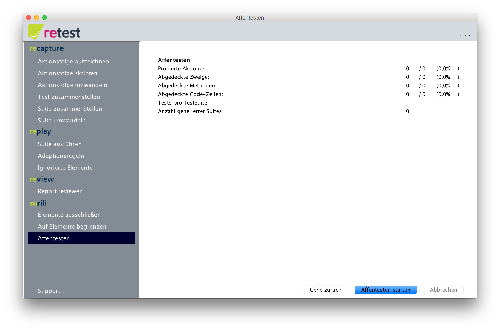
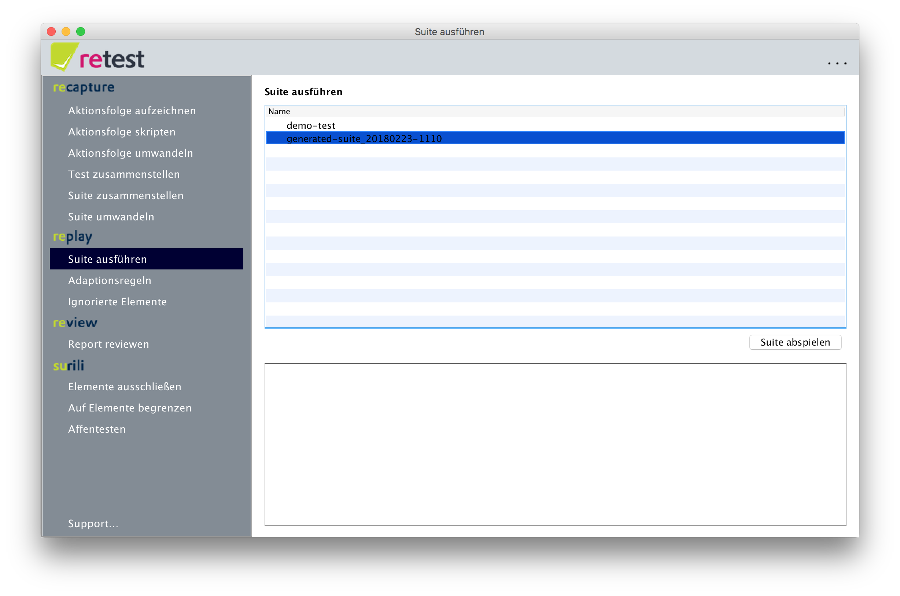

Das 2-Minuten Surili-Tutorial mit der retest Demo
=================================================

Mit retest brauchen Sie die Tests nicht Mal selbst aufzuzeichnen! Nutzen Sie zum Erzeugen der Tests einfach unseren digitalen Affen – Surili.

Affentesten eingrenzen
----------------------

Um nicht die ganze Anwendung auf einmal zu testen, sondern bspw. modulweise vorzugehen, klicken Sie auf den Menüpunkt "Auf Elemente begrenzen".

Klicken Sie hier auf "Starte Anwendung" um die Demo-Anwendung zu starten. Melden Sie sich mit Benutzer "Max" und Passwort "retest" an.
Klicken Sie nun auf "Markiere UI-Element". Klicken Sie nun im Tab "Adressbuch" der Demo-SUT auf eine leere Fläche auf dem Panel. 
Das gesamte Panel wird nun grün gefärbt und in der Tabelle in retest erscheint das UI-Element AddressbookPanel.

Klicken Sie nun auf "Speichern..." um diese Whitelist unter einem beliebigen Namen zu speichern.

Affentesten trainieren
----------------------

Um dem Affen beizubringen, wie er sich an der SUT anmelden kann, sollten Sie eine kurze Aufzeichnung mit dem Anmelde-Vorgang anfertigen.
Sie können dazu das [2 Minuten Tutorial zum Difference Testing](2-min-diff-testing-demo-tutorial.md) durcharbeiten.
Wenn Sie das schon getan haben, so brauchen Sie nichts weiter zu tun.

Affentesten konfigurieren
-------------------------

Um Surili zu konfigurieren und dann zu starten, klicken Sie einfach auf den Menüpunkt "Affentesten".

Hier wählen Sie Ihre gerade angefertigte Suite aus, um Surili die gültigen Zugangsdaten beizubringen.
Dann klicken Sie auf "Weiter".

Im nächsten Schritt können Sie im unteren Bereich die gerade erstellte Whitelist auswählen, damit Surili sich auf diesen Bereich der Anwendung fokusiert.

 Achtung: Wenn Sie Surili hier falsch konfigurieren, kann es sein, dass der Affe gar nichts tun darf und das Testen frühzeitig abbricht!

Klicken Sie nun ebenfalls auf "Weiter".

In dieser Maske können Sie Surili konfigurieren. 
Zu den Parametern gehört z.B. die Einschränkung des Testings auf bestimmte Code-Bereiche,
sowie verschiedene Parameter die die Effizienz und Dauer der Testgenerierung sowie das Ergebnis beeinflussen.
Mehr Details hierzu finden Sie unter [Konfiguration](../konfiguration).
Für dieses Tutorial lassen Sie einfach alle Einstellungen mit den voreingestellten Werten und klicken auf "Weiter".

In der folgenden Ansicht können Sie das Affentesten starten indem Sie den entsprechenden Button drücken.
Dann können Sie beobachten, wie Surili zuerst die ausgewählten Suites ausführt um den Anmeldevorgang zu lernen, 
und dann basierend darauf und dem Whitelisting einen Teil der Anwendung durchtestet.

Mit den eingestellten Parametern sollte Surili bereits nach kurzer Zeit mit Testen fertig sein.
Da der Vorgang zufallsbasiert ist, kann es sein, dass Ihre Ergebnisse von den hier gezeigten abweichen ...
sie sollten jedoch zumindest ähnlich sein.

 Achtung: Wenn der Affe sich nicht einloggen kann, 
dann stellen Sie sicher, dass die Suite, die Sie zum Trainieren benutzt haben aus, keine Unterschiede erzeugt, wenn Sie sie ausführen.  

Wenn Sie jetzt wieder auf "Suite ausführen" klicken, so sehen Sie dort nun eine zusätzliche Suite, 
mit dem Namen `generated-suite-` und dem aktuellen Tagesdatum.

Nun können Sie diese Suite direkt ausführen oder basierend auf dieser eine weitere Runde Affentesten starten
- d.h. Sie können das Affentesten auch iterativ durchführen (z.B. wenige Stunden pro Nacht) 
und jede Runde mit den Ergebnissen der vorherigen Runde trainieren.

Oder Sie schauen sich an, wie Sie Surili für bessere Ergebnisse [genauer parametrieren](../konfiguration) können.

Codeabdeckung wieder aktivieren
-------------------------------

Der genetische Algorithmus benötigt Informationen zur Codeabdeckung damit er funktioniert.
Um Probleme mit der Windows-Firewall zu umgehen, starten wir die Demo inderselben JVM -- ohne diese Infos. 
Um dieses Feature wieder zu aktivieren, bearbeiten Sie die `retest.properties`-Datei und löschen Sie die Zeile mit `de.retest.launcher=de.retest.launcher.DemoLauncher`.

