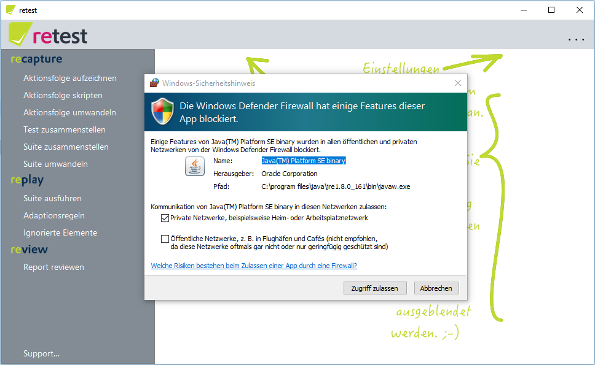
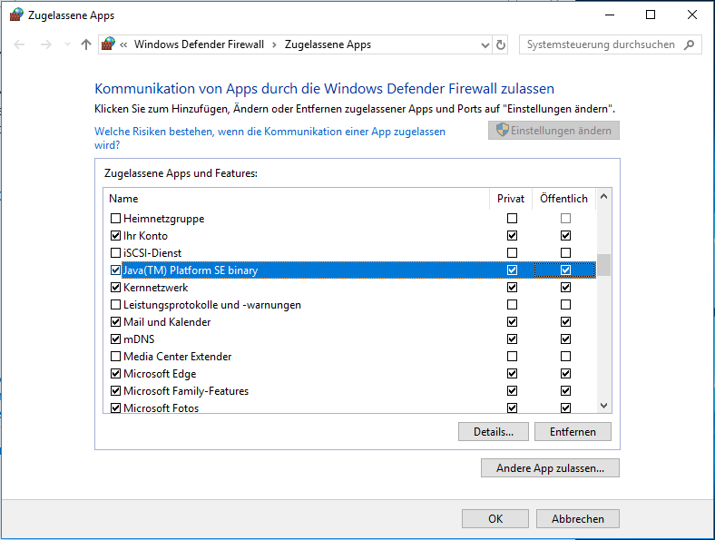

Verbindung von retest zur Anwendung (SUT)
=========================================

Damit retest von Ihrer Anwendung Aktionen aufzeichnen und abspielen kann, muss sich retest verbinden.
Diese Verbindung geschieht über das Netzwerk - auch wenn alles auf dem gleichen Computer passiert. 
Nun kann es sein, dass die Windows Firewall diese Verbindung verhindert.

Wenn Sie das erste Mal eine Java-Anwendung starten, die sich mit dem Netzwerk verbinden möchte, kommt folgendes Fenster:

In diesem Fall klicken Sie bitte auf "Zugriff zulassen".

Falls Sie bereits eine andere Java-Anwendung gestartet haben, die diesen Zugriff angefordert hat, ist es möglich, dass Sie bereits abgelehnt haben.
Dann müssen Sie in die Windows-Konfiguration (je nach Windows-Version unterschiedlich) und dort den Zugriff erlauben.

