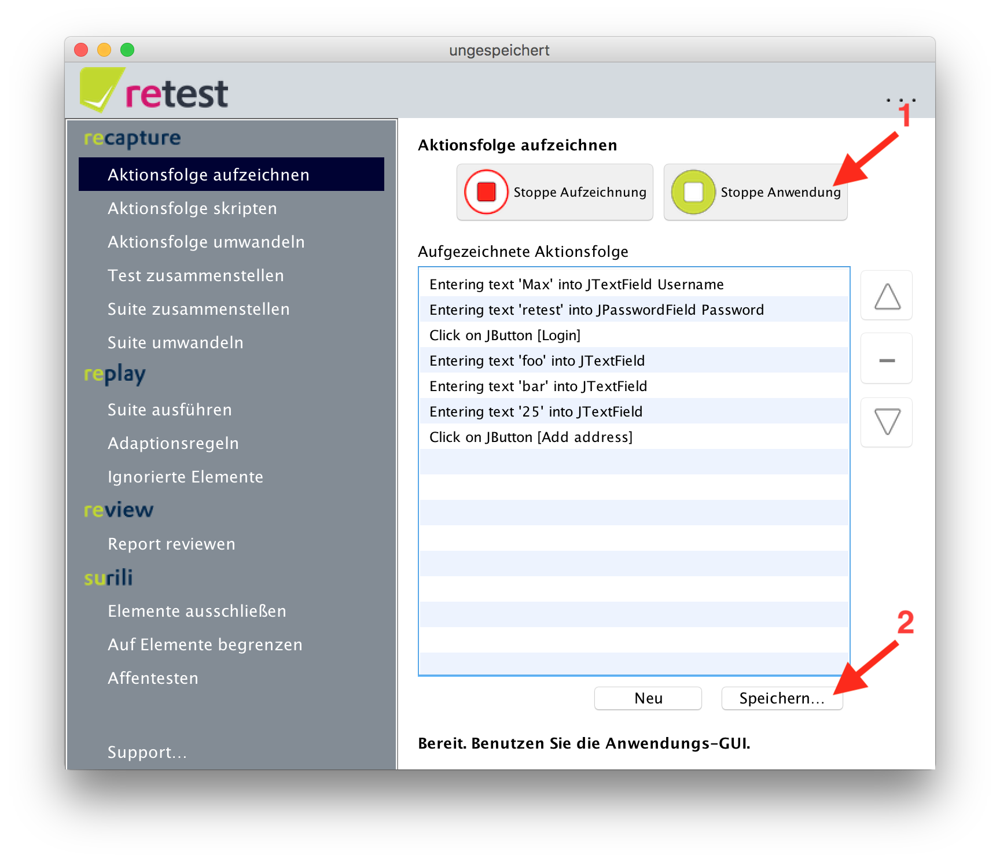

Aufzeichnen einer vollständigen Aktionsfolge
============================================

Man kann eine vollständige, in sich abgeschlossene Aktionsfolge aufzeichnen. 
Dazu klickt man im Menü auf "Aktionsfolge aufzeichnen" und dann auf den Knopf "Starte Aufzeichnung".
 

Jetzt startet die Ihre Anwendung, das [SUT](../testprozess/was-ist-die-sut.md). Sie können Sie einfach ganz normal verwenden und einen kompletten Anwendungsfall aufzeichnen, bspw. einen Benutzer anlegen, einen Import durchführen oder Ähnliches.

Nach Abschluss der Aufzeichnung beenden Sie einfach Ihre Anwendung oder klicken auf "Stoppe Anwendung". Nun können Sie die aufgezeichneten Aktionen mit "Speichern" abspeichern.
 

Damit Sie die Aktionsfolge nun als Suite direkt ausführen können, müssen Sie die Aktionsfolge noch [umwandeln](aktionsfolge-umwandeln.md).

