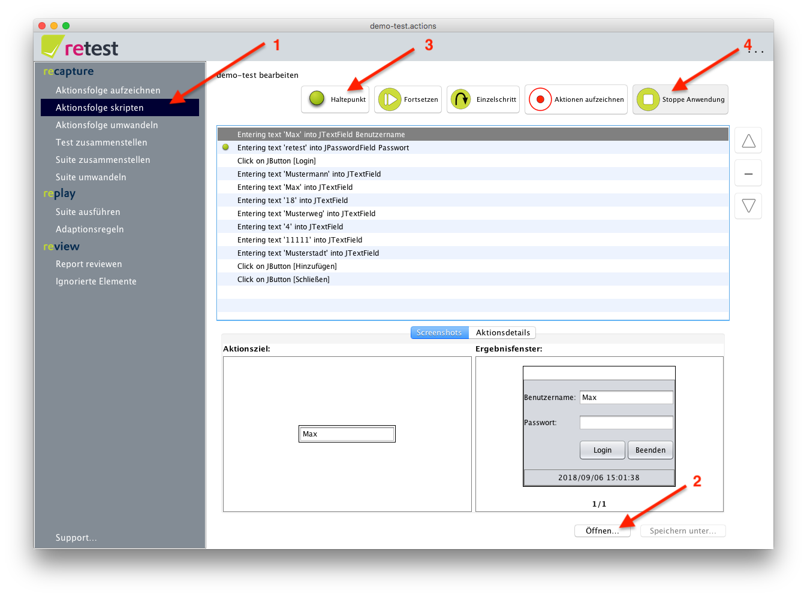

# Aktionsfolge bearbeiten

Man kann eine Aktionsfolge auch nachträglich noch anschauen oder bearbeiten.
Dazu klicken Sie einfach auf den Menü-Punkt "Aktionsfolge bearbeiten" (1).

In der sich öffnenden Maske können Sie über "Öffnen..." (2) eine Aktionsfolge laden.
Indem Sie auf einzelne Aktionen in der Tabelle klicken, können Sie die zugehörigen Aktionsziele und Ergebnisfenster anschauen.

Über "Haltepunkt" (3) können Sie einen Haltepunkt setzen, bis zu welchem die Aktionsfolge ausgeführt werden soll.
Über "Debug" (4) starten Sie nun die SUT, und es werden die Aktionen in der Aktionsfolge bis zum nächsten Haltepunkt ausgeführt. 

Wenn Sie an einem Haltepunkt halten können Sie entweder über "Fortsetzen" die Aktionsfolge bis zum nächsten Haltepunkt fortsetzen, 
über "Einzelschritt" die Aktionen einzeln ausführen, oder über "Aktionen aufzeichnen" weitere Aktionen aufzeichnen, 
welche dann in der Aktionsfolge nach dem Haltepunkt eingefügt werden.

Über die "Pfeil nach oben"-, "Minus"- und "Pfeil nach unten"-Knöpfe können Sie Aktionen entfernen oder umsortieren.
Mit "Speichern" speichern Sie Ihre Änderungen ab.

Wenn Sie eine Aktionsfolge geändert haben, sollten Sie sie erneut entweder [einzeln umwandeln](aktionsfolge-umwandeln.md) 
oder die zugehörige [Suite umwandeln](suite-umwandeln.md).

