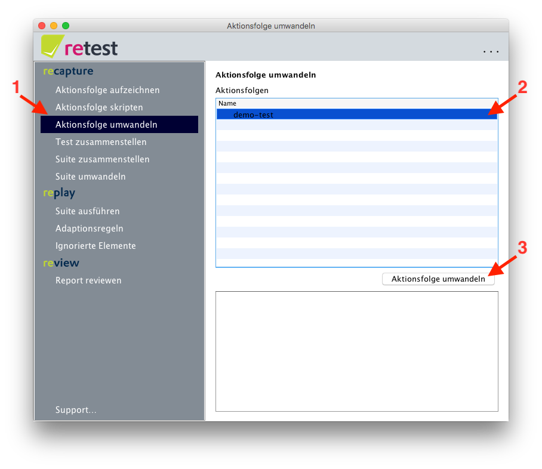

# Umwandeln einer vollständigen Aktionsfolge

Damit Sie eine Aktionsfolge als komplette Suite ausführen können müssen Sie sie zuerst umwandeln. 
Dazu haben Sie [mehrere Möglichkeiten](../howtos/wie-man-einen-test-aufzeichnet.md). 
Eine Möglichkeit besteht darin, die Aktionsfolge direkt als Suite umzuwandeln.

Dazu klickt man im Menü auf "Aktionsfolge umwandeln". 
Dann suchen Sie in der Liste der Aktionsfolgen diejenige heraus, die Sie umwandeln möchten.
Dann klicken Sie auf den Button "Aktionsfolge umwandeln". 
Nun wird die komplette Aktionsfolge nochmals abgespielt und mit den Zustandsinformationen von der GUI (alle angezeigten Werte und mehr) angereichert.
Der spezielle Ansatz von retest, genannt [Difference Testing](https://retest.de/product/difference-testing.md) erspart es Ihnen mühsam einzelne Prüfregeln zu definieren.
Statt dessen wird der gesammte Zustand der GUI erfasst und kann beim nächsten Abspielen überprüft werden.
  
 

Diese Aktionsfolge können Sie nun [ausführen](../replay/suite-ausfuehren.md).

