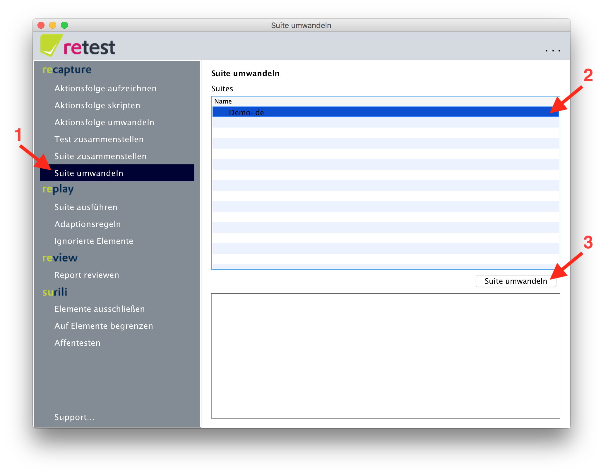

# Suite umwandeln

Nachdem Sie einen oder mehrere [Tests zusammengestellt haben](test-zusammenstellen.md), können Sie diese zu einer Suite zusammenfassen.

Klicken Sie dazu im Menü auf "Suite umwandeln".
In der Maske können Sie eine Suite auswählen, und klicken dann auf "Suite umwandeln".
Nun wird die komplette Suite nochmals abgespielt und mit den Zustandsinformationen von der GUI (alle angezeigten Werte und mehr) angereichert.
Der spezielle Ansatz von retest, genannt [Difference Testing](https://retest.de/product/difference-testing.md) erspart es Ihnen mühsam einzelne Prüfregeln zu definieren.
Statt dessen wird der gesammte Zustand der GUI erfasst und kann beim nächsten Abspielen überprüft werden.

Als nächstes können Sie die umgewandelte Suite [abspielen](../replay/suite-ausfuehren.md).

