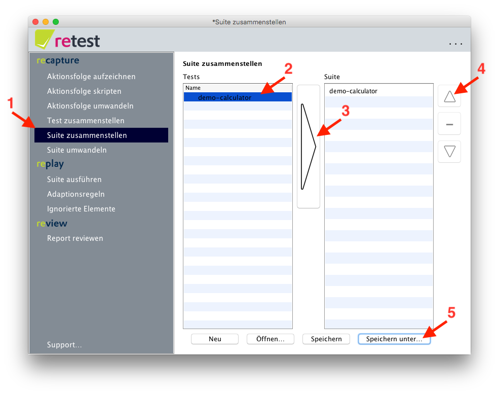

# Suite zusammenstellen

Mehrere Tests können zu einer Suite zusammengestellt und so logisch gruppiert werden.

Dazu klicken Sie im Menü auf "Suite zusammenstellen".
In der linken Spalte sehen Sie alle bereits [erstellten Tests](test-zusammenstellen.md).
Aus diesen können Sie per Doppelklick oder Klick auf den Pfeil beliebig viele in die rechte Spalte übernehmen – auch den gleichen Test mehrfach.
Durch Klick auf den Pfeil nach oben oder den Pfeil nach unten können Sie die Reihenfolge der Tests ändern.
Durch Klick auf das Minus können Sie Tests wieder aus der Suite entfernen.
Durch Klick auf "Speichern..." können Sie die Suite abspeichern bzw. mit "Neu" die Suite verwerfen.

 **Achtung:** retest speichert lediglich den relativen Pfad zum Test. 
Wenn Sie Tests auf Dateiebene nach dem Zusammenstellen der Suite verschieben, schlägt das Umwandeln fehl.

Nach dem Zusammenstellen einer Suite müssen Sie sie zunächst [umwandeln](suite-umwandeln.md). 

