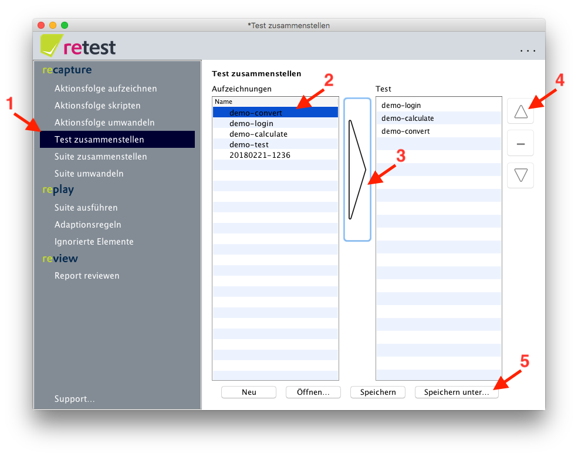

Test zusammenstellen
====================

Sie können einen Test aus einer oder mehreren [aufgezeichneten Aktionsfolgen](aktionsfolge-aufzeichnen.md) zusammenstellen. Ein Test stellt einen abgeschlossenen und isolierten Anwendungsfall dar. Zum Beispiel hat der Test 'Benutzerverwaltung' folgende Aktionsfolgen:

* Anmelden
* Benutzer anlegen
* Benutzer bearbeiten 
* Benutzer löschen
* Abmelden

Dabei darf ein Test die Anwendung jedoch *nicht mehrmals starten oder stoppen*. Dies sollte durch mehrere einzelne Tests realisiert werden.

Dazu klicken Sie im Menü auf "Test zusammenstellen".
In der linken Spalte sehen Sie alle bereits aufgezeichneten Aktionsfolgen.
Diese können Sie mit einem Klick auf den Pfeil oder mit einem Doppelklick in die rechte Spalte übernehmen - auch die gleiche Aktionsfolge mehrfach.
Durch Klick auf "Pfeil nach oben" oder "Pfeil nach unten" können Sie die Reihenfolge der Aktionsfolgen ändern.
Durch Klick auf "Minus" können Sie Aktionsfolgen wieder aus dem Test entfernen.
Durch Klick auf "Speichern..." können Sie den Test abspeichern bzw. mit "Neu" den Test verwerfen.

 **Achtung:** retest speichert lediglich den relativen Pfad zur Aktionsfolge. 
Wenn Sie Aktionsfolgen auf Dateiebene nach dem Zusammenstellen des Tests verschieben, schlägt das Umwandeln fehl.

Nach dem Zusammenstellen eines Tests müssen Sie sie zunächst aus einem oder mehreren Tests eine [Suite zusammenstellen](suite-zusammenstellen.md). 

