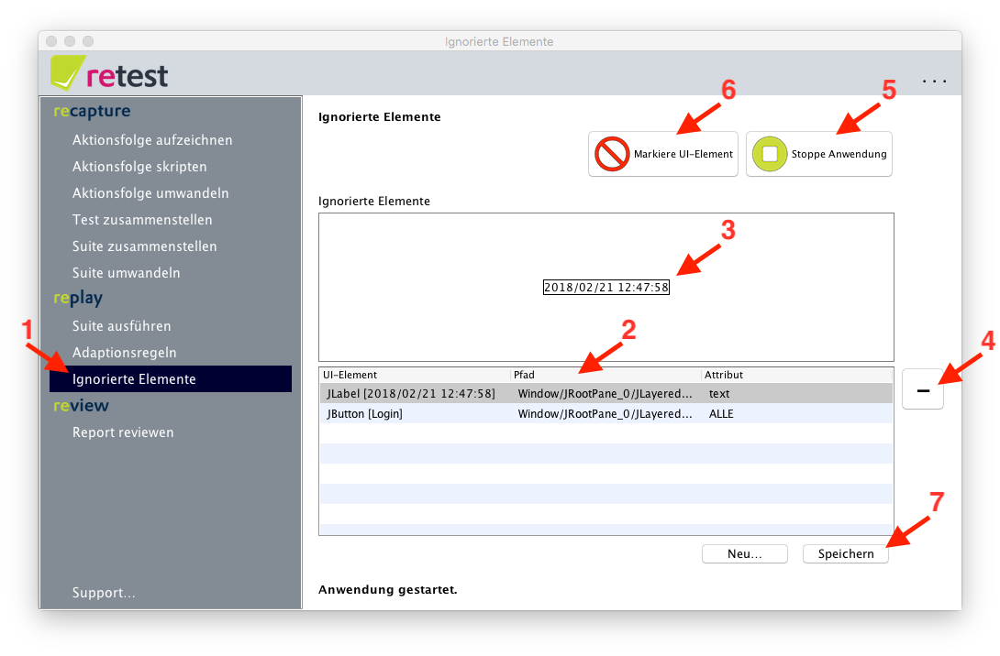
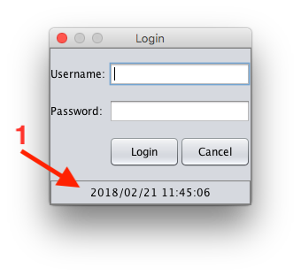

UI-Elemente ignorieren
======================

retest erlaubt es auch UI-Elemente dauerthaft zu ignorieren.

 Achtung: Unterschiede in ignorierten UI-Elemente *und allen Kind-Elementen* werden beim Ausführen einer Suite nicht mehr überprüft!

Dazu kann man entweder nach der Ausführung einer Suite [beim Review die Elemente ignorieren](../review/ui-elemente-ignorieren.md)
oder diese bereits vorher in der Anwendung markieren.

Außerdem kann man prüfen, welche UI-Elemente derzeit ignoriert werden. 
Dazu klicken Sie im Menü auf "UI-Elemente ignorieren" (1).
In der Tabelle sehen Sie alle UI-Elemente die derzeit ignoriert werden (2).
Wenn Sie auf eines klicken, so wird im Feld darüber ein Screenshot von diesem Element geladen (3).
Durch einen Klick auf das Minus-Symbol (4) können Sie UI-Elemente entfernen – diese werden dann künftig wieder überprüft.

Sie können zusätzliche UI-Elemente hinzufügen, indem sie Ihre Anwendung mit einem Klick auf "Starte Anwendung" (5) starten, 
und dann mit einem Klick auf "Markiere UI-Element" in den Markierungsmodus wechseln (6).

In diesem Modus werden derzeit ignorierte UI-Elemente grau markiert.
Zusätzlich kann durch einen Klick auf ein UI-Element dieses ebenfalls markiert und in der Tabelle hinzugefügt werden.
Alle Änderungen durch Hinzufügen oder Entfernen ignorierter UI-Elemente muss mit einem Klick auf "Speichern" (7) bestätigt werden.

