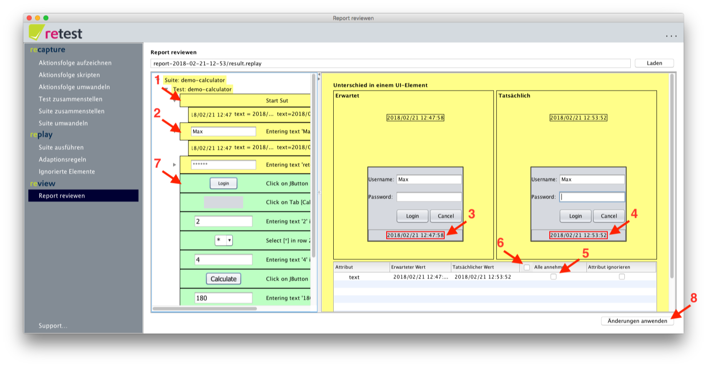
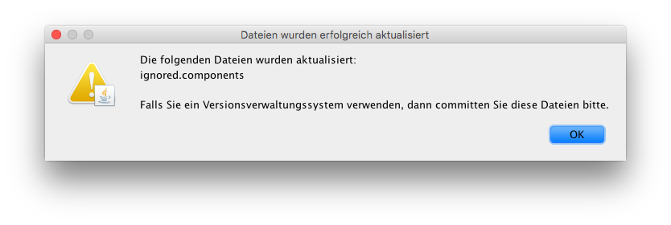

Unterschiede
============

Werden beim Vergleich der Attribute der Elemente Unterschiede festgestellt, so werden diese Unterschiede in der
Detailansicht angezeigt.

Die Unterschiede werden pro Aktion angezeigt (1), sind in der Baumstruktur aber auch nochmal nach Struktur gruppiert
(2). In der Detailansicht wird ein Screenshot der Maske mit deren Zustand während der Umwandlung angezeigt, alle
Unterschiede sind hierbei im Screenshot rot markiert (3). Daneben wird der Zustand der Maske beim Abspielen angezeigt.
Die Markierungen aus dem erwarteten Zustand werden dargestellt, um zu verdeutlichen, wo die Elemente erwartet worden
wären (4).

In der Tabelle darunter hat man die Möglichkeit, die gewollten Unterschiede einzeln mit einem Haken zu markieren (5).
Optional kann man auch alle Unterschiede durch einen Klick auf "Alle annehmen" im Tabellen-Header auf einmal annehmen
(6). Nach dem Annehmen werden die Elemente in der Baumstruktur, bei denen alle Unterschiede angenommen wurden,
entsprechend grün markiert (7). Wurden alle Unterschiede in der Aktion angenommen, wird auch die Aktion grün markiert.
Wurden alle Unterschiede in allen Aktionen angenommen, so wird der Test grün markiert. Und wurden alle Unterschiede in
allen Tests angenommen, so wird die Suite grün markiert.

Um die so bestätigten Unterschiede dauerhaft zu speichern und damit gleich die Suites zu pflegen, muss man nun noch auf
"Änderungen anwenden" (8) klicken. Dabei gilt es Folgendes zu beachten: Derzeit werden akzeptierte Änderungen nur in den
betroffenen ausführbaren Suites manifestiert. Nutzt man beispielsweise ein `replay.result` für diverse Änderungen,
schließt dieses und öffnet es im Anschluss nochmal, so scheinen die zuvor getätigten Änderungen verschwunden. Die
Änderungen sind zwar nicht sichtbar, jedoch aber vorhanden. Um ungültiges Bearbeiten hierbei zu verhindern, besitzen
ausführbare Suites eine spezielle [UUID](https://de.wikipedia.org/wiki/Universally_Unique_Identifier), die sich beim
Speichern verändert. Sie sollten daher Änderungen anwenden" nur einmal, nämlich am Ende des Bearbeitens, klicken.

Verwendet man ein [Versionskontrollsystem](../testprozess/prozess-mit-ci-server.md), so muss man in diesem die
aktualisierten Suites abschließend noch committen.

Es besteht auch die Möglichkeit [Unterschiede dauerhaft zu ignorieren](ui-elemente-ignorieren.md).

