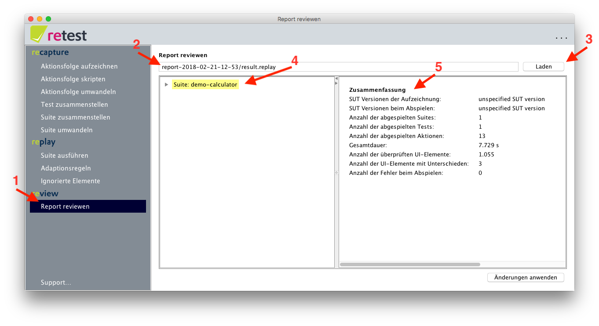

# Ergebnisse reviewen

Nachdem Sie eine Suite [abgespielt haben](../replay/suite-ausfuehren.md), öffnet sich automatisch das Fenster zum Reviewen der Ergebnisse.

Falls Sie eine [CI-Server verwenden](../testprozess/prozess-mit-ci-server.md), können Sie auch Datei vom CI-Server über das Eingabefeld oben auf der Maske (2) auswählen und mit "Laden" (3) laden.

Zunächst sehen Sie auf der linken Seite des Trenners alle abgespielten Suites aufgelistet (4), 
sowie eine Zusammenfassung über alle Ergebnisse (5):

1. Die Version Ihrer Anwendung bei Aufzeichnung und Abspielen (soweit diese erfasst wird).
1. Die Gesamtanzahl der ausgeführten Suites, Tests und Aktionen.
1. Die Gesamtdauer der Ausführung.
1. Die Gesamtanzahl aller überprüfter UI-Elemente.
1. Die Gesamtanzahl aller Unterschiede. Da jedes Element in jedem Schritt überprüft wird, kann diese Zahl schnell groß werden. 
Dank der [Benutzerfreundlichkeit](https://retest.de/product/usability.md) von retest, sollte Sie das jedoch nicht abschrecken.
1. Die Gesamtanzahl aller Fehler beim Abspielen. Dank der [Robustheit der Tests](https://retest.de/product/features.md) muss retest selten Tests abbrechen.

Durch einen Klick auf die abgespielten Suites (4) kann man sich die Detailergebnisse anschauen.
Diese sind in einer Baumstruktur aufgegliedert in Suites, Tests, Aktionen, und Unterschiede gruppiert nach Struktur.
Bei Klick auf einzelne Elemente dieses Baumes werden dann rechts dazu weitere Details angezeigt.

### Grundsätzlich sind drei Ergebnisse einer Suite-Ausführung möglich:

1. [Keine Unterschiede](ergebnisse-keine-unterschiede.md)
1. [Unterschiede](ergebnisse-unterschiede.md)
1. Fehler

Alternativ kann auch ein [HTML-Report](example-html-report.md) erzeugt werden, welcher dann z.B. von einem [CI-Server](../testprozess/prozess-mit-ci-server.md) aus direkt geladen werden kann.  

