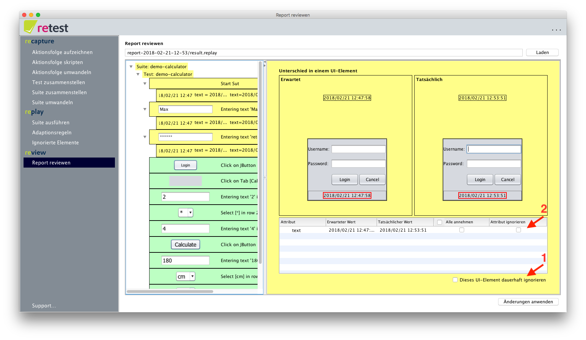

# UI-Elemente dauerhaft ignorieren

Man hat auch die Möglichkeit komplette UI-Elemente oder einzelne Attribute von UI-Elementen dauerhaft zu ignorieren.

Grundsätzlich sollte man versuchen eine stabile Testumgebung aufzubauen.
Trotzdem gibt es dann immernoch volatile Elemente, wie das Tagesdatum oder die Build-Version.
Obwohl dies je nach Anwendung natürlich variiert, so sollte sich die Anzahl dieser Elemente unserer Erfahrung nach jedoch in Grenzen halten.

Um ein Element dauerhaft zu ignorieren, kann man es direkt [in der Anwendung markieren](../replay/ui-elemente-ignorieren.md), 
oder es im Nachgang beim [Reviewen der Ergebnisse](index.md) (1) markieren.
Man kann auch nur einzelne Attribute von Elementen ignorieren (2), wie Text, Farbe oder Schriftart.
Den internen Pfad eines Elementes kann man nicht ignorieren, da dieser zur Identifikation unabdingbar ist.

Dazu muss man entweder in der Tabelle auf das Element klicken oder das Element in der Baumansicht auswählen.

 Achtung: Unterschiede in ignorierten UI-Elemente *und allen Kind-Elementen* werden beim Ausführen einer Suite nicht mehr überprüft!

Man kann sich sich auch jederzeit [anschauen](../replay/ui-elemente-ignorieren.md), welche Elemente derzeit ignoriert werden.

