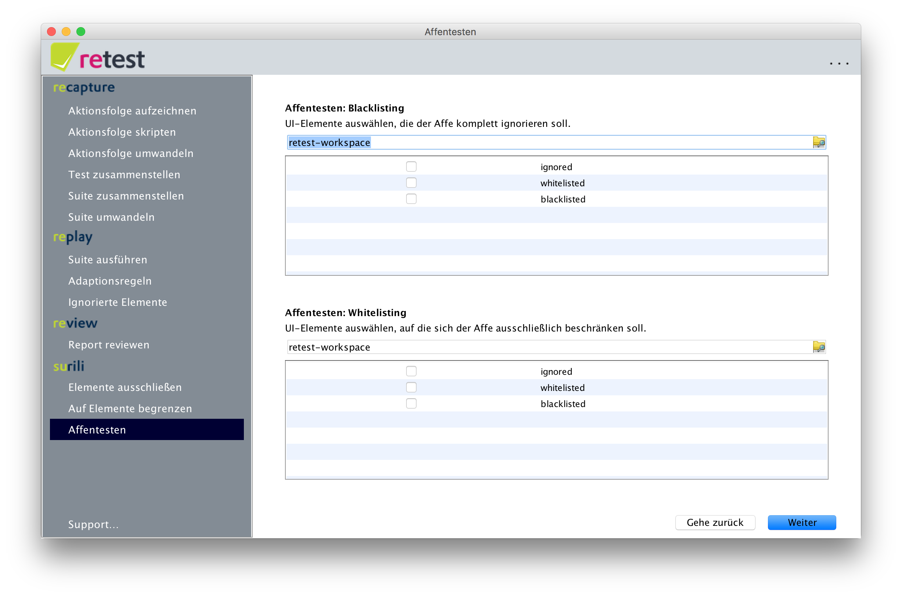

Black- und Whitelisting
-----------------------

Auf der zweiten Maske des Wizard kann man das [Black-](blacklisting.md) und [Whitelisting](whitelisting.md) von UI-Elementen konfigurieren.
Man kann beide Möglichkeiten miteinander kombinieren.

 Achtung: Durch eine fehlerhafte Konfiguration kann man dem Affen komplett verbieten die Anwendung zu testen! 
Nutzt man Whitelisting, so muss man jeden einzelnen Dialog den der Affe bedienen darf zur Begrenzungsliste hinzufügen!

Die nächste Maske erlaubt das einstellen weiterer [Affenparameter](affentesten-parameter.md).

