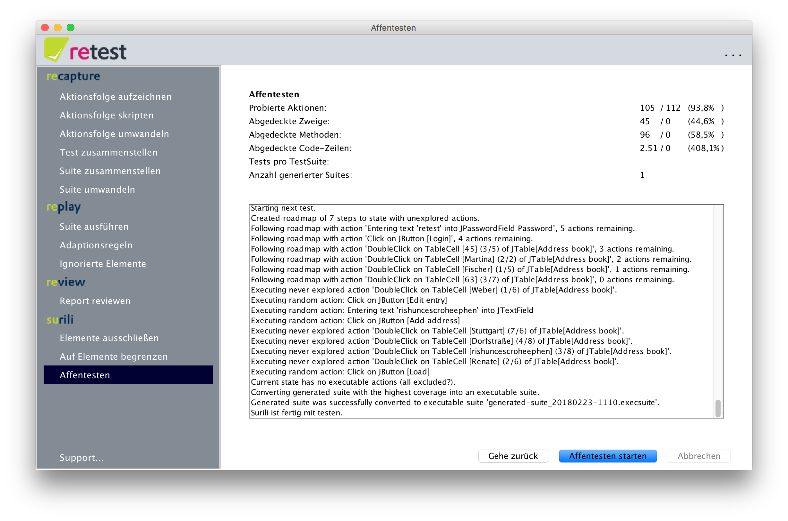

# Affentesten

Das Affentesten (Englisch "Monkey Testing") einer [SUT](../testprozess/was-ist-die-sut.md) kann man über den Menü-Punkt "Affentesten" starten.
Beim Affentesten wird unser digitaler Affe genannt [Surili](/index.md) Ihre SUT mit zufälligen Eingaben traktieren.

Unser Affe wird dabei zwei Dinge gleichzeitig tun:

* Er kann die SUT auf Robustheit Testen und Abstürze und Fehler suchen. Findet er einen Fehler bzw. bringt er die SUT zum Absturz, so exportiert er den zugehörigen Test als ausführbare Suite samt HTML-Bericht in den [`crashes`-Ordner im Workspace](../konfiguration/verzeichnisse.md).
* Er kann eine ausführbare Suite erzeugen, welche bereits mit Zustandsdaten angereichert ist, und direkt [in den CI-Prozess integriert werden kann](../testprozess/prozess-mit-ci-server.md), um jede Nacht die SUT auf Änderungen zu prüfen.

Aus mehreren Gründen empfiehlt es sich im Allgemeinen nicht die komplette Anwendung auf einmal testen zu wollen, sondern Masken-, Modul- oder Packetweise vorzugehen.
Einer der Gründe besteht ganz einfach darin, dass die Künstliche Intelligenz des Affen versucht, eine möglichst hohe Code-Abdeckung zu erreichen.
Testet man die gesamte SUT auf einmal, so wird der Affe jede einzelne Maske nur sehr oberflächlich und mit wenigen Eingaben testen.
Konzentriert man den Affen dagegen auf eine einzelne Maske oder ein einzelnes Modul, so wird er dieses wesentlich intensiver testen und folglich mehr Fehler zutage fördern.

Bevor man das Affentesten starten kann, wird man durch einen Wizard geführt, der einem die Konfiguration des Affen ermöglicht:

* [Den Affen trainieren](affentesten-trainieren.md)
* [Black- und Whitelisting](affentesten-listing.md)
* [Affenparameter](affentesten-parameter.md)

Den Affen starten
-----------------

Nachdem Sie den Affen konfiguriert haben, können Sie auf "Affentesten starten" klicken.
Dann wird der Affe zunächst trainiert, d.h. die ausgewählten Suites werden ausgeführt, und der Affe analysiert diese bei der Ausführung.
Danach wird der Affe basierend auf diesem Wissen beginnen die SUT systematisch auszuführen und zunächst alle UI-Elemente (je nach Black-/Whitelisting) ausprobieren.
In einem dritten Schritt wird der Affe nun so lange die Tests abwandeln und neu zusammenfügen, 
bis entweder ein Abbruchkriterium erreicht ist, 
bis der Nutzer auf "Abbrechen" klickt, 
oder bis der Affe für mindestens TODO Generationen die Abdeckung nicht mehr erhöhen kann.

Als Endergebnis erzeugt der Affe ein ausführbare Suite, die er im [`execSuites`-Verzeichnis im Workspace](../konfiguration/verzeichnisse.md) ablegt.
Diese Suite kann natürlich in einem weiteren Durchgang wiederum zum Trainieren des Affen genutzt werden.
Somit kann ein iterativer Prozess realisiert werden, in welchem Beispielsweise der Affe jeden Tag wenige Stunden testet
und die Ergebnisse des Vortages am nächsten Tag weiter verwendet.

Stößt der Affe während des Testens auf einen Fehler, so wird er einen neuen Ordner mit dem Fehlertyp (bspw. `java.lang.NullPointerException`) sowie Datum und Uhrzeit als Namen
im Verzeichnis [`crashes` im Workspace](../konfiguration/verzeichnisse.md) anlegen, und dort die zugehörige ausführbare Suite und einen HTML-Bericht ablegen, 
in welchem der Test Schritt für Schritt inklusive Screenshots beschrieben ist. 

