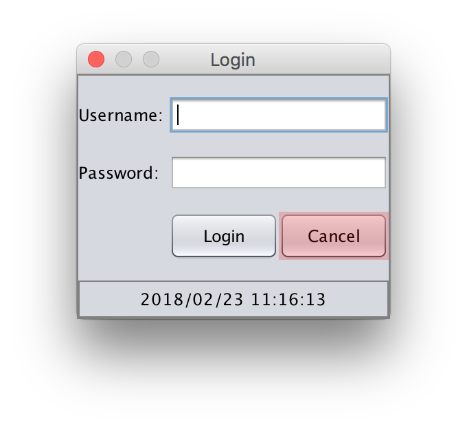

Ausschließen von Elementen
==========================

Das Ausschließen von Elementen für den Affen, auch Blacklisting genannt, dient dazu dem Affen bestimmte potentiell kritische UI-Elemente komplett zu verbieten.
Sinnvollerweise zählen dazu bspw. ein "Drucken"-Knopf, ein "Email senden"-Knopf oder ein "Atomraketen starten"-Knopf.  

Solchermaßen kann eine globale Liste von Elementen erstellt werden.
Manchmal möchte man jedoch situativ bestimmte UI-Elemente ausschließen, bspw. wenn diese langlaufende Prozesse starten.
Deshalb kann man mehrere Ausschlusslisten erstellen und pflegen.

Diese Ausschlusslisten können im Menü-Punkt "Elemente ausschließen" erstellt werden.
Diese Maske funktioniert prinzipiell genau wie die Maske ["Elemente ignorieren"](../replay/ui-elemente-ignorieren.md).

Der einzige Unterschied besteht darin, dass die Elemente rot markiert werden.

