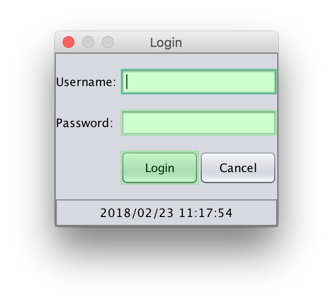

Auf Elemente begrenzen
======================

Das Whitelisting dient dazu, den Affen auf bestimmte Masken oder Module zu fokusieren.
Dies ist z.B. sinnvoll, falls man sich nicht sicher ist, ob man alle kritischen UI-Elemente mittels Blacklisting "verboten" hat.

Außerdem Hilft es dem Affen sich beim Testen schneller auf ein bestimmtes Modul, Package oder ein Klasse zu fokusieren:
Mit Hilfe seiner Künstlichen Intelligenz und der integrierten Abdeckungsanalyse wird der Affe sich langfristig auf das konfigurierte Modul bzw. Packet konzentrieren.
Zuvor wird er jedoch versuchen einmal alle Eingabeelemente der SUT auszuprobieren, um alle Möglichkeiten zu entdecken, wie er Funktionalität im Zielpacket ausführen kann.
Dieser Prozess kann je nach Größe und Komplexität der SUT sehr lange dauern.
Wenn man weiß, dass bspw. eine bestimmte zu testende Funktionalität nur aus bestimmten Masken erreichbar ist, 
kann es sehr sinnvoll sein den Affen auf diese Masken zu fokusieren, um den Testprozess enorm zu beschleunigen.

Diese Begrenzungslisten können im Menü-Punkt "Auf Elemente begrenzen" erstellt werden.
Diese Maske funktioniert prinzipiell genau wie die Maske ["Elemente ignorieren"](../replay/ui-elemente-ignorieren.md).

Der einzige Unterschied besteht darin, dass die Elemente grün markiert werden.

