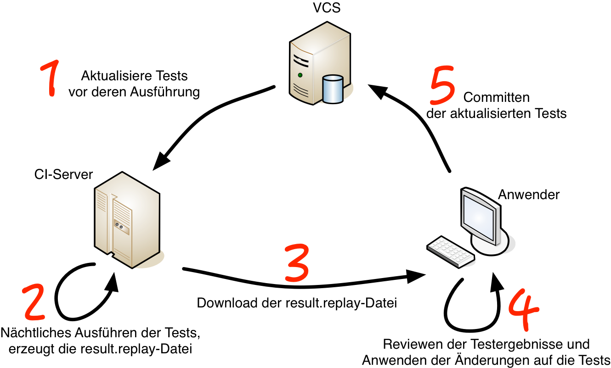

# Der Testprozess mit einem CI-Server

[Versionsverwaltungssysteme](https://de.wikipedia.org/wiki/Versionsverwaltung) (eng. Version Control System - VCS) und 
[CI-Server](https://de.wikipedia.org/wiki/Kontinuierliche_Integration) gehören heute zum Standardrepertoire an Tools die man bei der Softwareentwicklung einsetzen sollte.

Setzt man beides ein, so ist es besonders einfach retest mit diesen zu integrieren.
Dabei sollten die retest-Artefakte im Repository des Versionsverwaltungssystems liegen.

Dann gestaltet sich der Testprozess wie folgt:

1. Die Tests werden vor deren Ausführung aus dem Versionsverwaltung (VCS) aktualisiert.
2. Der CI-Server führt die Tests jede Nacht aus und erzeugt dabei die `replay.result`-Datei.
3. Der Benutzer kann den Status mit dem HTML-Report und einer [TAP](https://testanything.org/)-Integration (bspw. für den [Jenkins](https://wiki.jenkins-ci.org/display/JENKINS/TAP+Plugin)) direkt online prüfen. Zum Aktualisieren der Tests lädt er die `replay.result`-Datei herunter.
4. Der Benutzer prüft die Testergebnisse und verwirft die Änderungen (wenn es sich um Fehler handelt) oder nutzt retest um [mit wenigen Klicks](https://retest.de/product/features.html) die Änderungen anzunehmen und die Tests zu pflegen. 
5. Danach committed er die aktualisierten Tests im Versionsverwaltungssystem. Solchermaßen wird auch dokumentiert und nachvollziehbar, wer welche Änderung akzeptiert hat.
6. Entspricht 1.: Beim nächsten Ausführen der Tests aktualisiert der CI-Server die Tests wieder mittels dem Versionsverwaltungssystem.  

