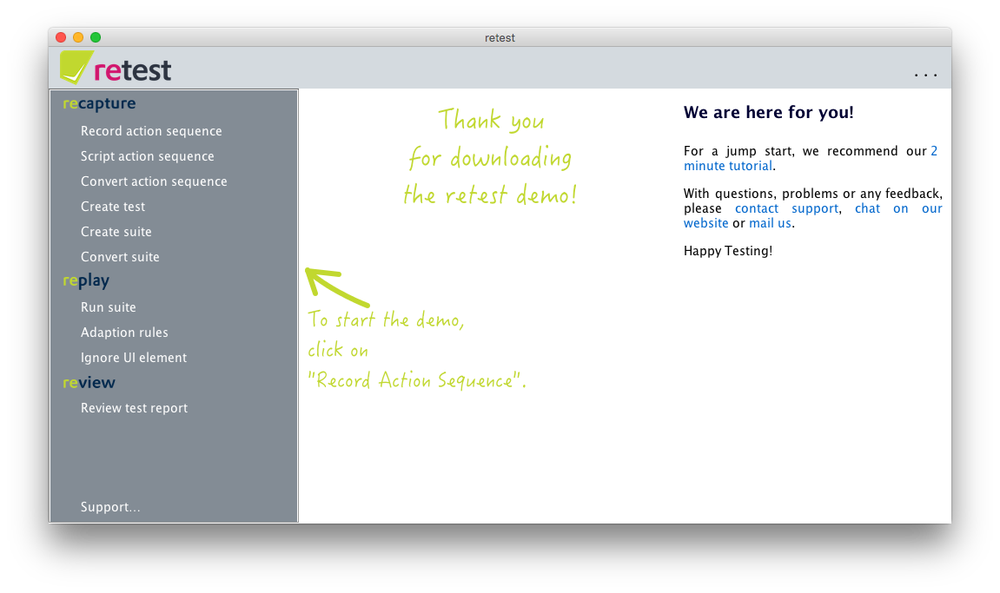
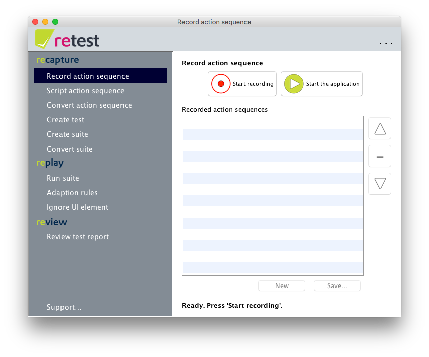
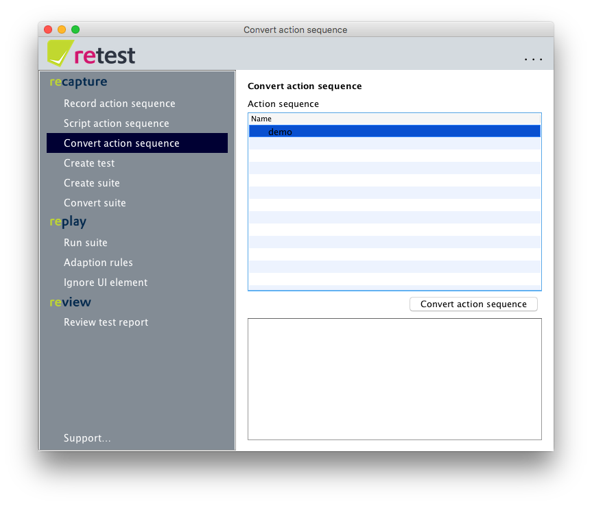
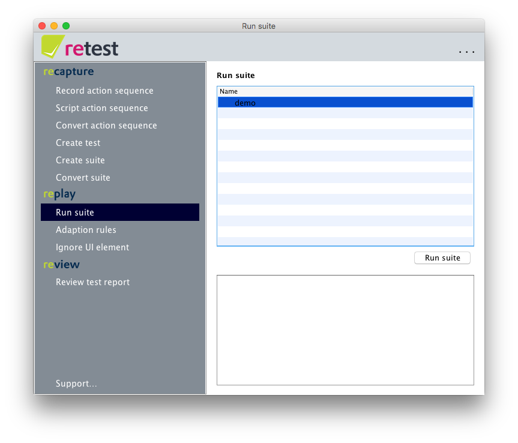
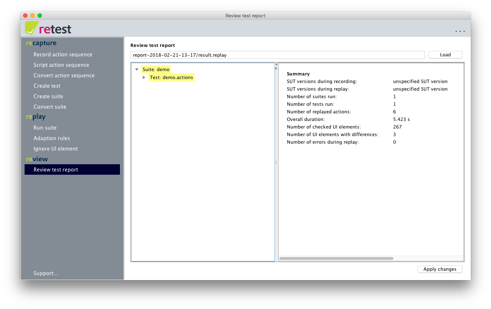
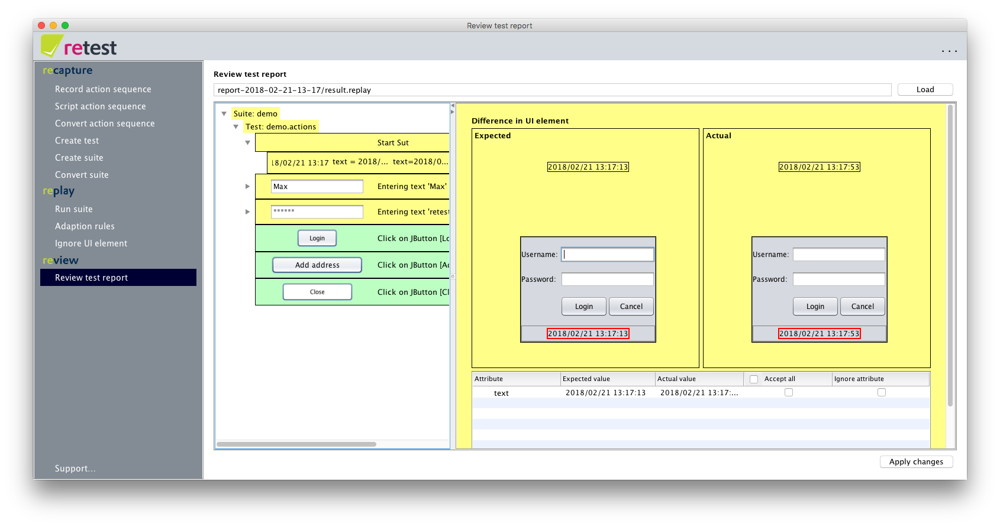
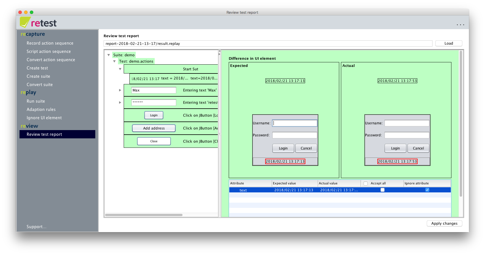
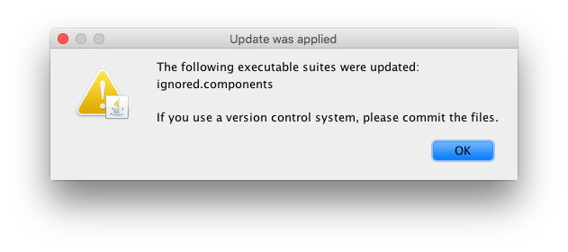
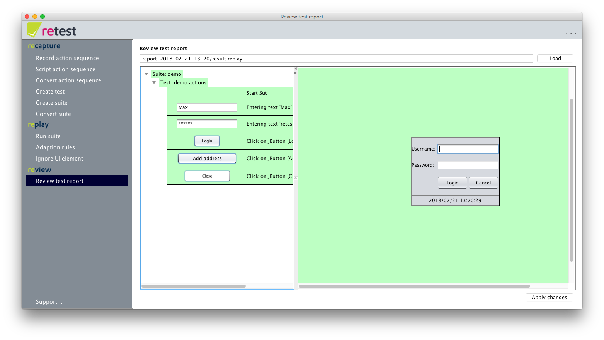
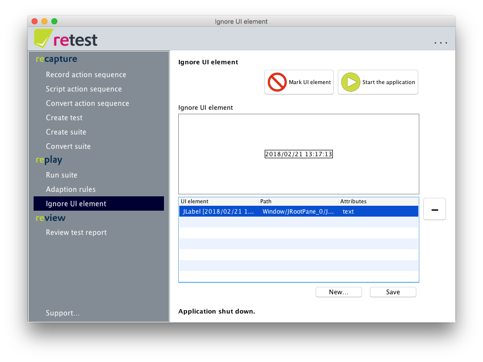

The 2-minute Difference Testing tutorial with our demo application
==================================================================

If you have downloaded the retest demo, then you have a zip file.
After unzipping you will find three folders:

1. `retest` contains all data from retest and should remain unchanged.
2. `retest-workspace` contains all the work data from retest: Configurations, action sequences, tests, suites, reports, log files, ...
3. `system-under-test` contains the application to be tested, in this case a small demo.

Open the folder `retest` and, depending on the operating system, doubleclick `retest-gui.exe` (Windows)
or the executable `retest` file (Linux/Mac). Then retest should start and the start screen should open.
If you encounter any problems, please contact http://feedback.retest.de/ or send an e-mail to [support@retest.de](mailto:support@retest.de).

As you can see, the menu is on the left. It can be displayed and hidden by clicking on the retest logo.
To the bottom of the menu you will find a link to our [support](http://feedback.retest.de/).
In the right section you will see a small explanation, which changes depending on the menu point currently open and gives help and tips.
These explanations can be displayed and hidden in the menu of the `...` button in the upper right corner by clicking on 'Show description'.

Capture and convert a test
--------------------------

To capture a small test, simply click on "Record Action Sequence" in the menu.

In the view that opens, you can e.g. click on "Start recording".
Then the login window of our demo application opens.

Here you can login with user name "Max" and password "retest". 
Now e.g. try to edit a value in the table.
Click on "Stop application" and then "Save ..." to save your new test under any name.

Then click "Convert Action Sequence" from the menu.

This view allows you to re-run your newly-recorded action sequence.
This will convert it to an executable suite and provide it with status information about the SUT.
To do so, select your created action sequence and press "Convert action sequence".
You can now see how retest replays the sequence.

Test and review
---------------

Now you can run your suite by selecting the "Run suite" menu item.

Select your newly created suite and press "Run Suite".
The suite is replayed again - and afterwards the "Review test report" menu item is opened automatically
and the execution results of your suite are displayed.

In the left part of the view you can see a tree structure, which you can expand by clicking on the tree items.
At the top level, you see suites, then tests, then individual actions, then changed UI elements.
As you can see, we also use color coding:
Green means there was no change after the execution of a test step,
yellow means there were changes.

As you can see, there were already changes - so the first three test steps are highlighted in yellow.
Open the tree structure and navigate, e.g. to the first action "Start SUT".

As you can see, the changes come from the display of the time on the login dialog of the SUT.
Since time changes continuously, it makes no sense to accept this change.
Instead, click the "Ignore" check box in the table column to permanently ignore the `text` attribute of this element,
or ignore the entire UI element and all child elements permanently by clicking on the "Ignore element permanently" checkbox.

In both cases, you can see how the complete report now turns green, since retest automatically applies the same changes to all affected UI elements.
To apply these changes permanently, click "Apply Changes".

A small dialog box will appear that shows all the changed files in detail, and reminds you to "commit" them should you have a version management system for your tests.

Click again on the "Execute Suite" menu item and run your suite again.

As you can see, the suite is completely green - meaning there were no changes.
If you want to see which elements and attributes are currently ignored by retest,
just click on the "Ignore UI element" menu item.

Next, you can record more complex tests and suites and interactively debug your recordings.
Or you can complete our [2 minute Surili tutorial with the retest Demo](2-min-surili-demo-tutorial.md).

