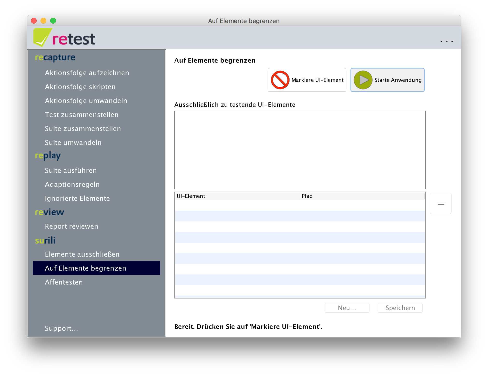
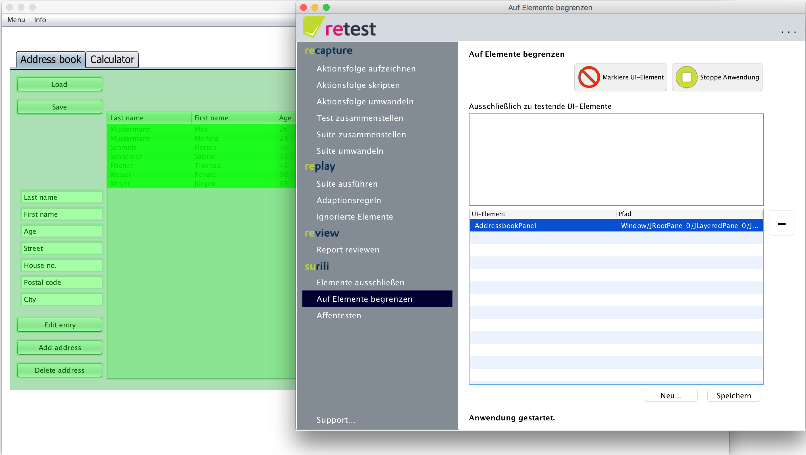
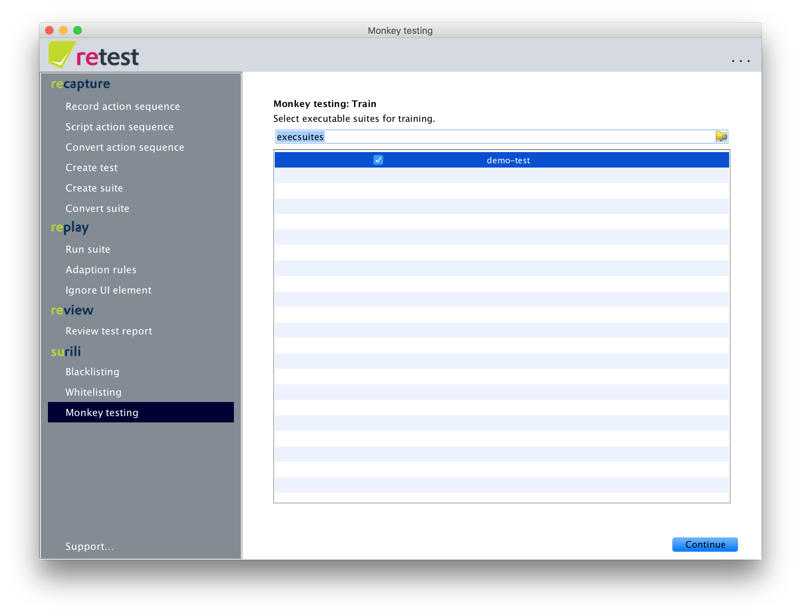
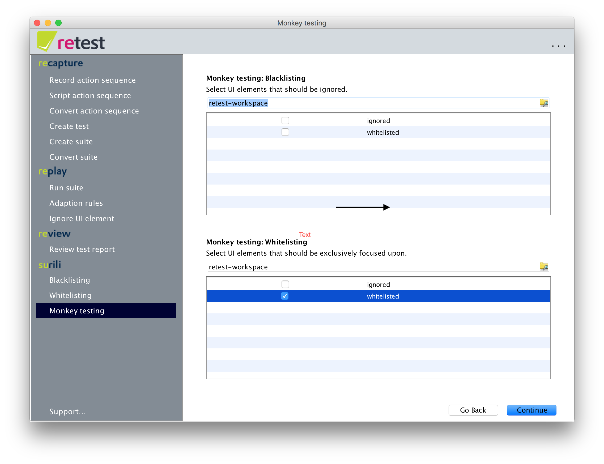
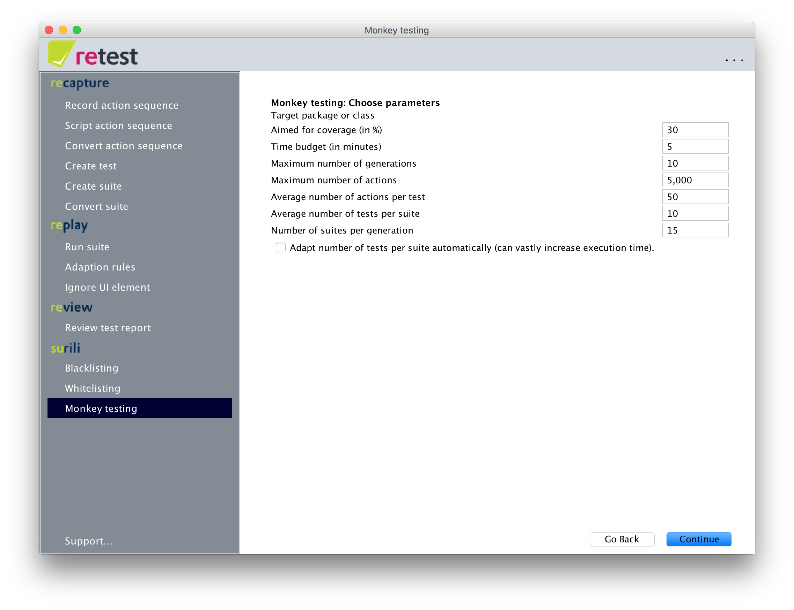
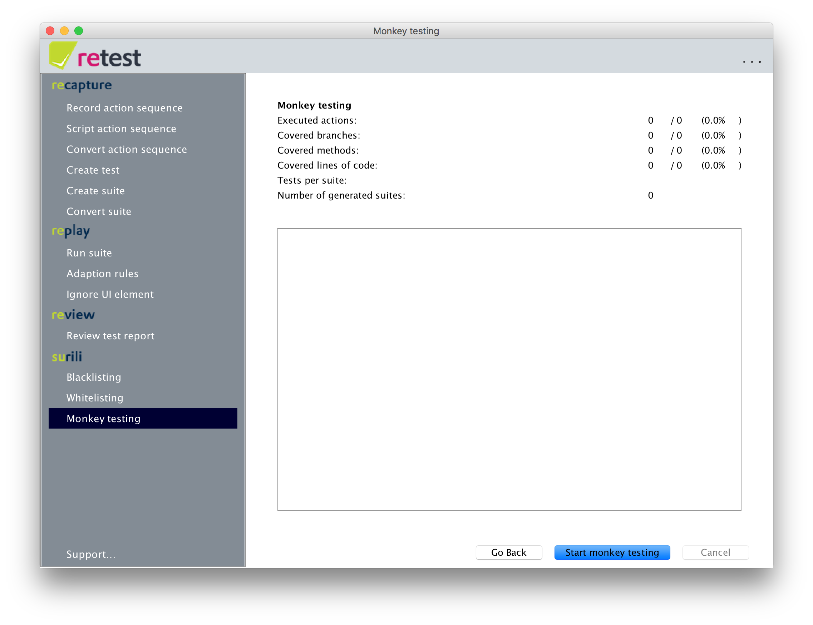
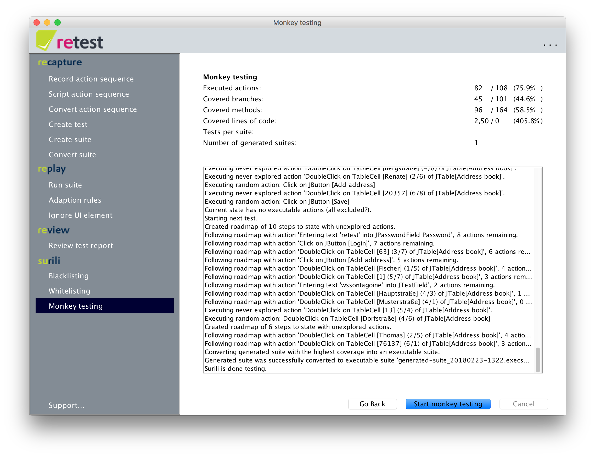
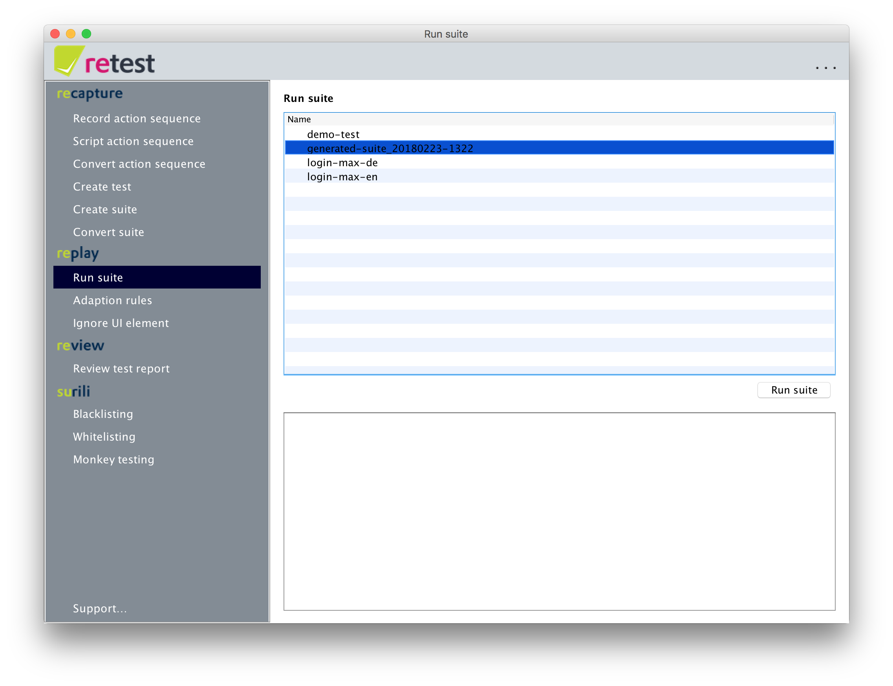

The 2-minutes Surili tutorial with our demo application
=======================================================

With retest, you do not even have to record tests yourself! 
Just use our digital monkey -- Surili -- to create the tests.

Confined Monkey Testing
-----------------------

You probably want to avoid testing the whole application at once.
Instead you woudl test, for example, per module.
To achieve this, click on the menu point "Whitelisting".

Click on "Start the application" to start the demo application. 
Log in with user "Max" and password "retest".
Now click on "Mark UI Element". 
In the "Address Book" tab of the Demo-SUT, click on an empty area on the panel.
The entire panel is now colored green and the UI element AddressbookPanel appears in the table in retest.

Click on "Save ..." to save this Whitelist under any name.

Training the Monkey
-------------------

To teach the monkey how to login into the SUT, you should create a short executable suite with the login process.
You can work through the [2 minutes tutorial on difference testing](2-min-diff-testing-demo-tutorial.md) to do so.
If you have already done so, you need nothing else to do.

Configure Affentests
--------------------

To configure and then start Surili, simply click on the "Monkey testing" menu item.

Here you can select your newly created suite, to provide Surili with the valid access data.
Then click "Continue".

In the next step, you can select the Whitelist you just created in the lower section, so that Surili can focus on this area of ​​the application.

 Warning: If you configure Surili incorrectly here, the monkey may not be allowed to do anything and the test will terminate early!

Now click on "Continue".

In this screen, you can configure Surili.
The parameters include e.g. the limitation of the testing to concentrate certain code areas,
as well as various parameters which influence the efficiency and duration of the test generation as well as the result.
For this tutorial simply leave all settings with the default values ​​and click on "Continue".

In the following view you can start the Monkey Testing by pressing the appropriate button.
Then you can see how Surili first runs the selected suites to learn the login process,
and then, based on and whitelisting, tests part of the application.

With the given parameters, Surili should be done with testing already after a short period of time.
Because the operation is random based, your results may differ from those shown here ...
But they should at least be similar.

 Note: If the monkey seems unable to login, 
please run the suite you used for training and make sure it does not show any differences!

If you click again on "Run Suite", you will now see an additional suite,
With the name `generated-suite-` and the current date.

Now you can run this suite directly or start another round of Monkey Testing based on this one.
This means you can also iteratively improve the results (for example, a few hours per night)
and each round train the monkey with the results of the previous round.

Reactivate Code Coverage
------------------------

The genetic algorithm needs coverage data to work. 
To circumvent the Windows firewall, we start the demo in the same JVM without that data. 
To reenable this feature, simple edit the `retest.properties` file and delete the line with `de.retest.launcher=de.retest.launcher.DemoLauncher`. 

