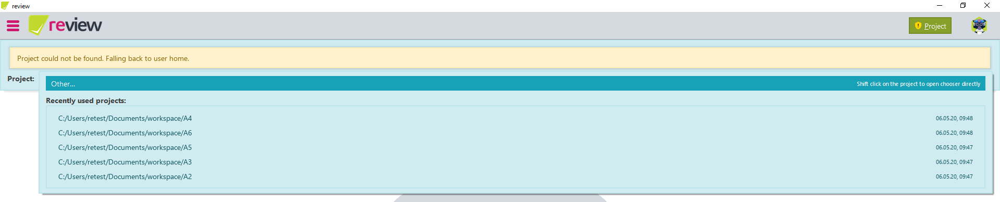

# Projects

A project contains the [Golden Masters](../../recheck/files/state.md) and [filters](../../recheck/usage/filter.md) for ***recheck*** and is identified by a `.retest` folder, which should be generated automatically with the first test execution:

```text
.retest/
    filter/
    recheck.ignore
```

!!! note
    The Golden Master location and name is determined by the provided [configuration](../../recheck/usage/configuration.md).

## Discovering projects

By default, ***review*** expects a report to be placed within the project directory. Simply place the report you want to open in the correct project directory (this is not possible when loading reports from rehub). If it cannot find the project and therefore the Golden Masters, it will only allow to ignore the encountered differences.

In order to find a project, ***review*** automatically tries to find the project relative to the report location, traversing upwards and choosing the first project encountered. If ***review*** is unable to find a project it will be considered "missing" and ***review*** will fall back to the user home and use it similar to a project.

## Managing projects

!!! warning 
    This feature is only available with the standard license. If you do not own such a license, please [buy one here](https://account.retest.de/subscriptions).

The project can be viewed and changed by clicking on the menu project button. A banner will appear displaying the currently active project and an optional warning or error message.


By clicking on the project, you can select any recently used projects or choose a new project from your file system. 



!!! tip
    You can open the project chooser directly when pressing ++shift++ and clicking on the project or using the shortcut ++ctrl+shift+p++ when the project banner is visible.

When manually selecting a project via the project chooser, ***review*** will search for a project relative to the selected location, similar to searching a project for a report.

## Changing projects

!!! warning
    Changing a project will discard all ignored changes made to a report. Thus it is recommended to check if the correct project has been found before viewing the report.

If ***review*** automatically discovers a project, it will intelligently load the discovered project. Should loading the project result in a destructive operation (e.g. overwrite the active project), the discovered project will be set to pending. An error will be displayed and ***review*** will ask for confirmation whether to continue or to abort the loading process. If you decide to discard the change, the pending project will not be loaded.


A simplified table for changing the project can be found below.

| Active project | Pending project | Action                                                                |
| -------------- | --------------- | --------------------------------------------------------------------- |
| missing        | missing         | &mdash; (*no action needed*)                                          |
| missing        | present         | Load pending project                                                  |
| present        | missing         | Reset active project (*confirmation needed*)                          |
| present        | present         | Overwrite active project with pending project (*confirmation needed*) |

Selecting a recently used project from the list, the active project will be overwritten without the need to confirm the change.
